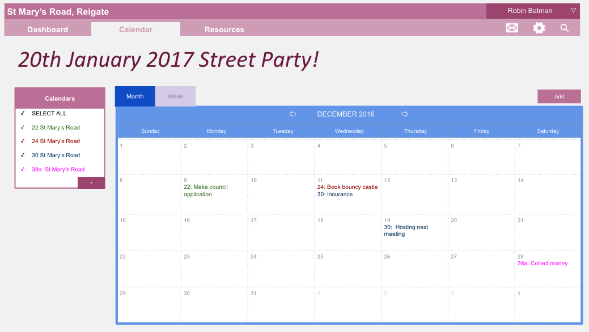
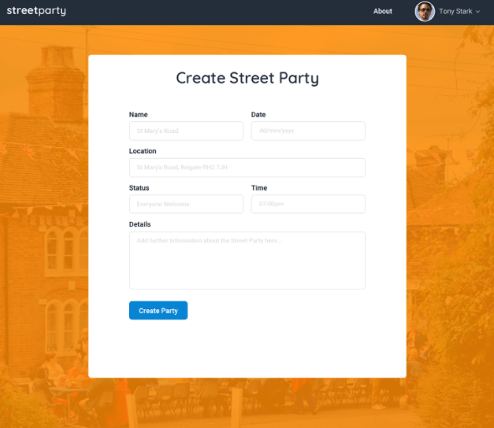
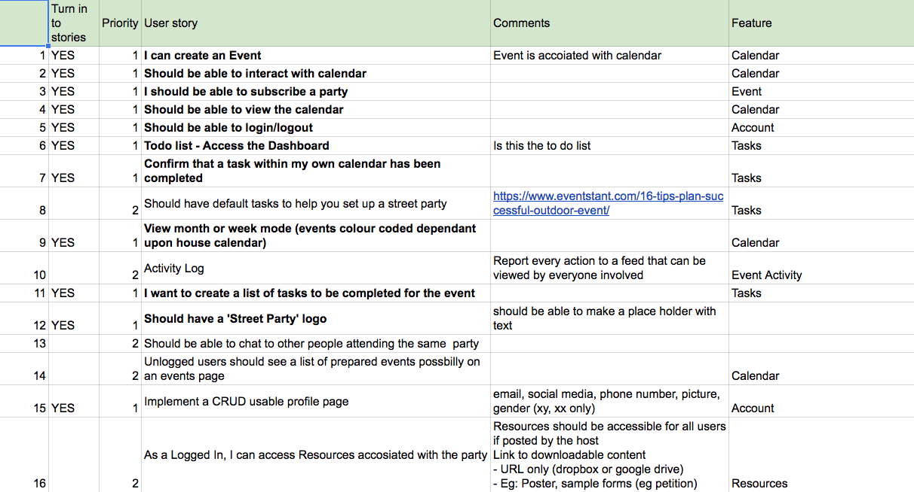

# Street Party

## Concept
#### Original Concept
Inspired by the Queens jubilee, a member of our group had an idea for an app which would help to organise street parties. This was following a bad experience attempting to host a party on his own street with some minor success. It could have definitely been improved with better organisation!

#### Developed Concept

<insert text here>

#### Final Design Concept

<insert text here>

## The App
[Street Party](street-party.herokuapp.com)
* Register on the website
* Create a new party
* Create new tasks on the calendar by clicking on a specific date
  * Edit the task by clicking on the specific task
  * Assign the task by filling in an assignee
* Check the Tasks
* Check your Profile

## Product Development
#### Breaking Down the Project

On this page we put down everyone's ideas which could possibly be implemented.

Once we had everyone's initial ideas it was then necessary to whittle down the ideas into groups of MVP, Nice-to-Have and Moonshoots.

After having the product broken down into each category it was then necessary to flesh out the MVP ideas.

#### Waffle

After breaking the project down into smaller pieces it was now possible to make them into user stories. Once they were individual user stories we were able to utilize the Kanban style of project management along with Scrum mentalities.

## Product Screencaps
